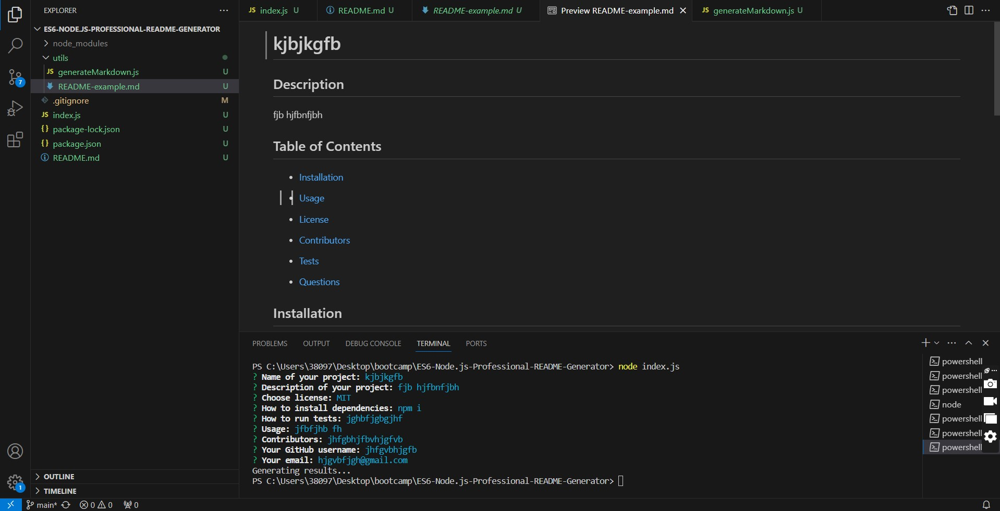

# Working with ES6 & Node.js: Professional README Generator

## Description

Command-line application that dynamically generates a professional README.md file from a user's input using the Inquirer package.

GitHub repository: https://github.com/iabramidze/ES6-Node.js-Professional-README-Generator
walkthrough video: https://youtu.be/NQWQROl-pWc

## References

https://www.geeksforgeeks.org/node-js-process-cwd-method/
https://www.geeksforgeeks.org/node-js-path-join-method/
https://www.geeksforgeeks.org/nodejs/